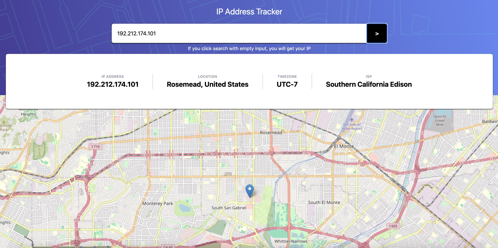

# IP Address Tracker

A React application that lets you look up any IP address or domain and see its location pinpointed on an interactive map.



## Live Demo

[p-glazowski.github.io/ip-address-tracker](https://p-glazowski.github.io/ip-adress-tracker)

## Features

- 🔍 Look up any IP address or domain name
- 🗺️ Interactive map with smooth fly-to animation
- 📍 Displays IP, location, timezone (UTC offset), and ISP
- 📱 Responsive layout — works on mobile and desktop
- 🌐 Leave the input empty to detect your own IP automatically

## Tech Stack

- [React](https://react.dev) + [TypeScript](https://www.typescriptlang.org)
- [Vite](https://vitejs.dev)
- [Tailwind CSS](https://tailwindcss.com)
- [Leaflet](https://leafletjs.com) + [React Leaflet](https://react-leaflet.js.org) — interactive map
- [OpenStreetMap](https://www.openstreetmap.org) — map tiles
- [ip-api.com](https://ip-api.com) — IP geolocation data

## Getting Started

```bash
# Clone the repo
git clone https://github.com/p-glazowski/ip-adress-tracker

# Install dependencies
cd ip-adress-tracker
npm install

# Run locally
npm run dev
```

## Usage

1. Enter an IP address (e.g. `8.8.8.8`) or a domain (e.g. `github.com`) in the input field
2. Click the **>** button or press Enter
3. The map will fly to the location and display IP info in the card above
4. Leave the input **empty** and click search to look up your own IP

## Build & Deploy

```bash
# Build for production
npm run build

# Deploy to GitHub Pages
npm run deploy
```

## Author

[Piotr Głazowski](https://github.com/p-glazowski)
